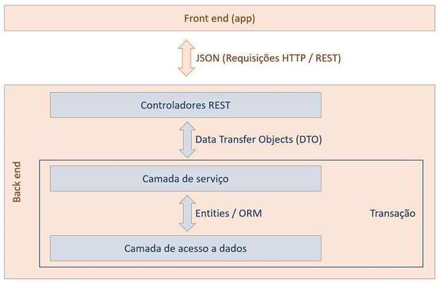

# Java Spring - Construindo a base de uma API RESTful
### _Aplicação produzida como projeto parte da semana de imersão Java Spring (devSuperior)_

Este projeto é focado em desenvolvimento backend e concentrou-se em algumas especialidades e temas relacionados às seguintes tecnologias:
- Linguagem Java
- Framework Java Spring com Spring Boot
- SQL (H2 Database para testes e PostgreSQL)
- Noções sobre Docker
- Versionamento GIT
- Postman

### Funcionamento
A aplicação produzida com o uso do Spring Boot teve como foco a construção de uma base de dados de jogos simples, inicialmente no H2 para testes e posteriormente no PostgreSQL através do Docker. Foram então criados os devidos endpoints necessários para consultar os dados armazenados e fazer as requisições.

A aplicação foi construída através do seguinite padrão em camadas, baseado na definição de DTO's para o acesso aos itens.



Os EndPoints criados e os respectivos retornos a partir de arquivos JSON foram:

==(GET)==
- _/games_ - Apresenta todos os games instanciados 
- _/games/{id}_ - Apresenta game de um ID específico
- _/lists_ - Apresenta dados de todas as listas de games disponíveis (Divididas em categorias)
- _/lists/{id_lista}/games_ - Apresenta todos os games de uma lista específica

==(POST)==
- _/lists/{id_lista}/replacement_ - Solicita reorganização de games numa lista, recebe no body sourceIndex - Index do jogo que se quer realocar numa lista & destinationIndex - Index que o jogo deve agora ocupar

_exemplo:_
```
{
    "sourceIndex": 3,
    "destinationIndex": 1
}
```

### Conclusões
Neste projeto pude exercitar meus conhecimentos com a linguagem Java e aprofundar mais meus estudos sobre o framework Spring e as possibilidades que oferece.
Entendi mais sobre API's RESTful, Docker e o funcionamento geral do modelo em camadas.
